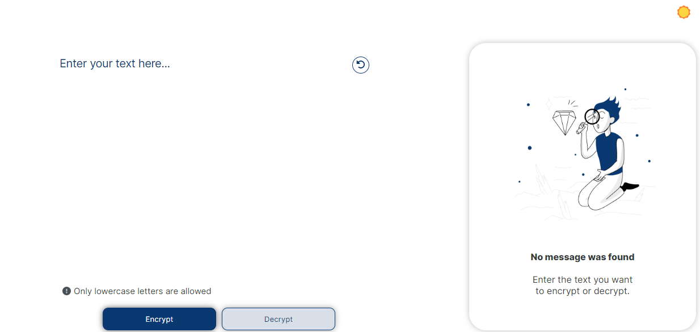
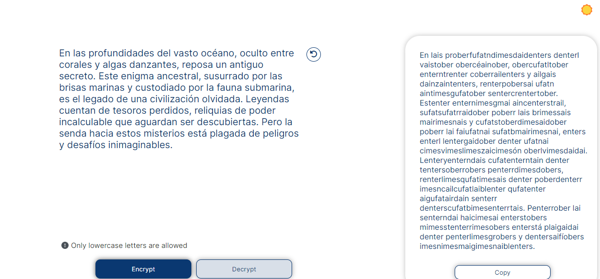
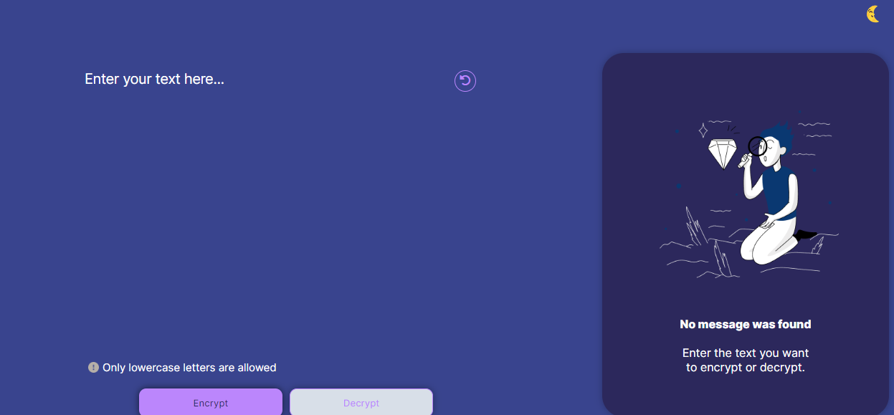
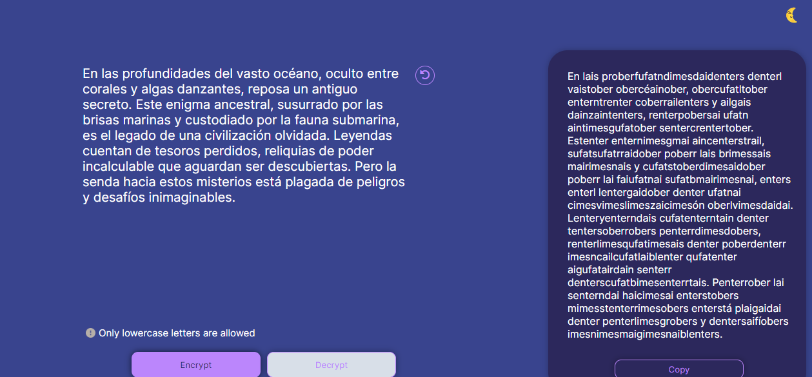

# Text Encryptor

## Description
Text Encryptor is a web-based tool designed for simple and efficient encryption and decryption of text. Utilizing modern encryption algorithms, this application ensures your information remains private and secure.

## Features
- **Text Encryption**: Allows users to encrypt input text, making the information secure.
- **Text Decryption**: Enables users to decrypt previously encrypted text with the correct key.
- **User-Friendly Interface**: Designed with an intuitive user interface, making text encryption and decryption accessible to users of all levels.
- **Clipboard Copy**: Functionality to copy the encrypted/decrypted text to the clipboard with a single click.

## Technologies Used
- HTML5
- CSS3
- JavaScript

## How to Use
1. **Encrypt Text**: Enter the text you wish to encrypt in the text area and click the "Encrypt" button. The encrypted text will appear in the output area.
2. **Decrypt Text**: To decrypt, enter the encrypted text in the text area and click the "Decrypt" button. The decrypted text will be displayed in the output area.
3. **Copy to Clipboard**: Click the "Copy" button to copy the encrypted/decrypted text to the clipboard.

## How it looks
- Light mode
  
  
- Dark mode
- 
  

## Installation
No installation required. Access [Project URL] to start using Text Encryptor.

## Contributing
If you're interested in contributing to this project, please follow these steps:
1. Fork the repository.
2. Create a new branch for your feature or fix.
3. Make your changes.
4. Submit a pull request.

## License
This project is licensed under the MIT License. For more details, see the LICENSE file.

## Contact
If you have any questions or suggestions, feel free to contact me via [LinkedIn](https://www.linkedin.com/in/mar%C3%ADa-camila-amaya-rodr%C3%ADguez/) or [GitHub](https://github.com/CmilAmaya).
